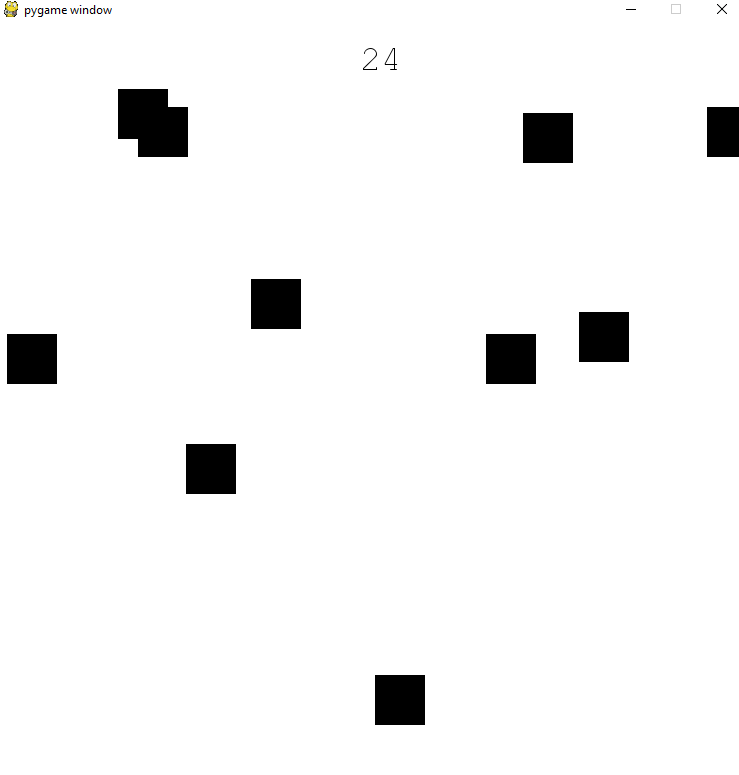

# SkyFall
Several mechanics are taking place behind the scenes:
- Event Listeners wait for user input (keyboard press) and update player position fields accordingly.

- Block collisions are being calculated every millisecond to see if the player has made contact with a falling block

- Falling blocks are randomly generated and increase in count with respect to score. Speed of falling blocks and player increase as well.

